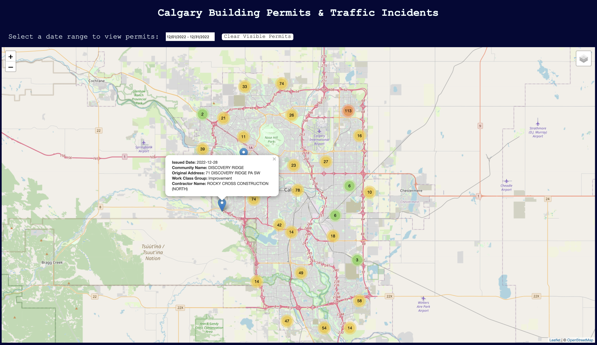

# City of Calgary Building Permit and Traffic Incident Viewer

ENGO 651 - Adv. Topics on Geospatial Technologies - Projects 3 & 4

By Chavisa and Adam

## Description

In project 3, we implement a simple web app for users to view building permits issued by the City of Calgary.  In project 4, we extend the functionality of the app to display a style layer created with [Mapbox](https://www.mapbox.com).

---

At the top of the page, we use a widget from [daterangepicker.com](https://www.daterangepicker.com) to allow the user to select start and end dates and view up to 1000 building permits issued within that date range. The results are displayed as markers on the main [Leaflet](https://leafletjs.com) map.  When a marker is clicked, a popup displays additional information about the particular building permit.  To ensure the map doesn't get too crowded with markers, we utilize the [Marker Cluster](https://github.com/Leaflet/Leaflet.markercluster) plugin to group nearby markers into clusters which dynamically update when they are clicked or when the user zooms on the map.  This plugin also allows us to spiderfy markers which have the same location so that they can be differentiated.  The markers can be cleared from the map using the "Clear Visible Permits" button.

A Mapbox [style layer](https://api.mapbox.com/styles/v1/arsmith/clen9o9ks000101mmj8tcfsz0.html?title=view&access_token=pk.eyJ1IjoiYXJzbWl0aCIsImEiOiJja2tsYmFlenMwamUwMm9sc2hmYng5bDJoIn0.g5KpRpg0jDycvXHqlX8OPw&zoomwheel=true&fresh=true#9.7/51.0257/-114.0569) was created to display [traffic incident data](https://data.calgary.ca/Transportation-Transit/Traffic-Incidents-Archive-2017/himp-urp7/data) from Open Calgary's data portal.  This layer was added to the map and is accessible via the layer control widget in the top right corner of the map.

## File descriptions

The file [index.html](./application/index.html) defines the content composing the frontend of our application and links to the required libraries and plugins.  All styling is contained in the [style.css](./application/style.css) file.

The file [script.js](./application/script.js) contains the backend logic of the application.  In this file, we instantiate a Leaflet map and add a basemap provided by [OpenStreetMap](http://www.openstreetmap.org) and the traffic incident layer created in Mapbox.  jQuery is used to define the properties and functionality the date picker widget.  Once a date range is selected, we retreive building permit data from the [Open Calgary](https://data.calgary.ca) API and display the returned information using markers and popups on the map.  Two sample images are also included to preview the applications.

The [data](./data) directory contains the traffic incident data viewable on our application.  In the file [csv_data_extraction.py](./data/csv_data_extraction.py), we extract the number of vehicles involved in each incident from the description field fo the datafile and create a new column in the modified datafile with this information.  This is used to adjust the size of out data markers on the Mapbox map layer depending on vehicle count.